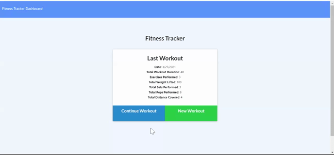

# WorkoutTracker
With this application the user will be able to view, create, and track daily workouts. The user will be able to log multiple exercises that apply to their workout routine and then click on finish workout and go to dashboard to see an overview of their total workout routine. It will have an option to log cardio workouts with the ability to track miles. For all other exercises there will be an option to track the name, type, weight, sets, reps, and duration.

## Technologies
* HTML
* CSS
* Express
* MongoDB
* Mongoose
* Javascript
* AJAX

## Video Demonstration

## URLs
Heroku: https://powerful-retreat-39538.herokuapp.com/
